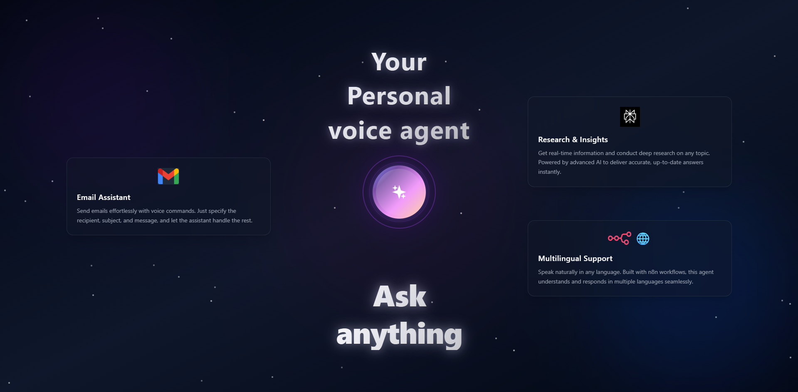
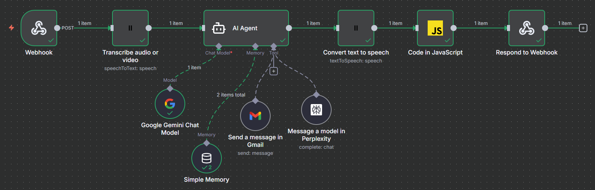

# 🌐 Multilingual Voice Agent

A real-time multilingual AI-powered voice assistant capable of listening, understanding, and responding to users in multiple languages. This system enables natural conversations, automates tasks such as sending emails, performs live research, and responds back using synthetic speech. Designed with a modern UI, smooth animations, and seamless backend automation.

---

## 🚀 Key Features

- 🎙️ Real-Time Speech Recognition  
- 🧠 Conversational AI using LLM  
- 🔊 Text-to-Speech Audio Responses  
- 🌍 Multilingual Voice Support  
- 📩 Voice-Based Email Automation  
- 🔎 Live Research using Web APIs  
- 💬 Chat UI with timestamps & history  
- 🪄 Smooth UI animations & status states  
- ⚙️ Fully automated via n8n workflows  

---

## 🖥️ Tech Stack

### Frontend

- React.js (main UI framework)
- Tailwind CSS (styling and layout)
- Web Speech API (browser-native speech recognition)
- HTML Audio API (text-to-speech playback)

### Backend

- n8n Workflow Automation (orchestration backbone)
- Webhook Handler (connects frontend to backend)
- AI Agent Node (Google Gemini or any LLM)
- Text-To-Speech Generator (e.g., ElevenLabs, Google, AWS, or browser TTS)
- Gmail API (for sending email automation)
- Perplexity API (for live research/information retrieval)

---

## 📸 Screenshots

### Home Screen  


### n8n Workflow 


---

## 🏗️ System Workflow (Architecture)

Frontend _(React)_  
↓  
Webhook Request _(message + optional audio)_  
↓  
n8n AI Agent Workflow  
↓  
Tool Execution _(Email/Research/General Reply)_  
↓  
TTS Generation  
↓  
Return JSON _(text + base64 or URL audio)_  
↓  
Frontend plays & displays result

---

## 🔧 Installation Steps

### 1️⃣ Clone Repository
```
git clone https://github.com/Taha-Lcode/multilingual-voice-agent.git
```

### 2️⃣ Install Frontend Dependencies
```
cd frontend
npm install
npm run dev
```

### 3️⃣ Setup n8n Backend

- Create Workflow using nodes:
  - Webhook Trigger
  - AI Agent Node (Gemini / GPT)
  - Memory Store
  - Gmail Tool
  - Perplexity Tool
  - TTS Node
  - Respond Node
- Copy webhook URL → paste into frontend `.env`.

### 🧾 Environment Variables

_Create `.env` in frontend:_
```
VITE_WEBHOOK_URL=your-n8n-webhook-url
```

---

## 🧪 How to Use

- Open webpage
- Click the voice orb
- Speak in any language
- Assistant analyzes your speech
- It replies with text + speech
- Chat history updates automatically

---

## 🔍 Supported Use-Cases

- Ask general questions (Q&A)
- Research topics and get live information
- Voice-composed emails (automation)
- Conversational task automation
- Language-switched, multilingual dialogue

---

## 📦 Project Structure
```
project/
├─ frontend/
│ ├─ src/
│ ├─ components/
│ ├─ App.jsx
│ └─ ...
└─ n8n/
└─ workflow/
```

---

## 🛠️ Future Enhancements

- Multi-language TTS voices
- Persistent user history
- Offline ASR caching
- Calendar & Slack Integrations
- Wake-word activation
- Account login/authentication

---

## ⚠️ Known Limitations

- Speech API requires supported browsers
- Requires active internet connection
- Microphone permission is mandatory
- TTS output quality depends on provider
- Gmail API requires user authentication
- Workflow failures may interrupt queries
- Language switching depends on browser ASR
- Latency for very long/complex requests

---

## 📚 References & Bibliography

- Google Speech API documentation
- Web Speech API documentation
- n8n Official Docs
- Gmail Actions API Docs
- Perplexity API Docs
- Gemini Model Docs
- [Research: Multilingual Voice Assistants](https://ijirt.org/publishedpaper/IJIRT151772_PAPER.pdf) [web:8]

---

## 👨‍💻 Author

Mohd Taha Saleem  
📧 <tahasaleem.md@gmail.com>
🔗 [LinkedIn](https://linkedin.com/in/taha01saleem)